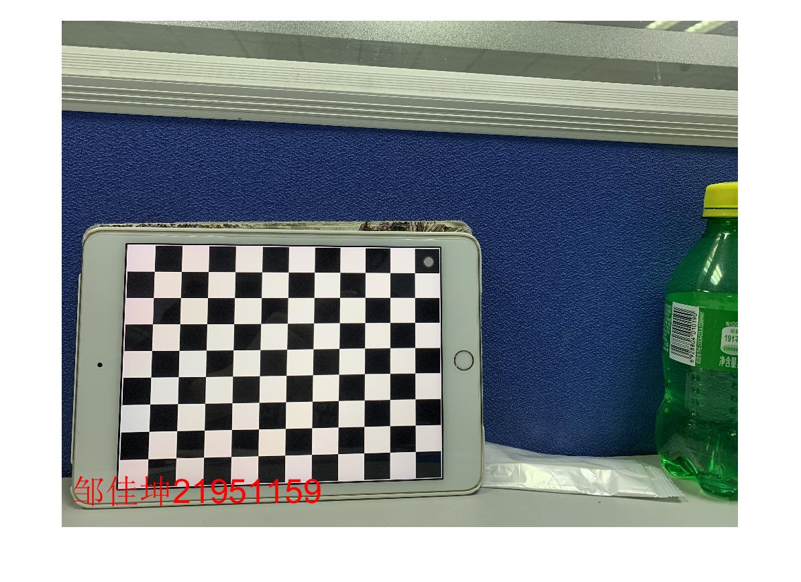
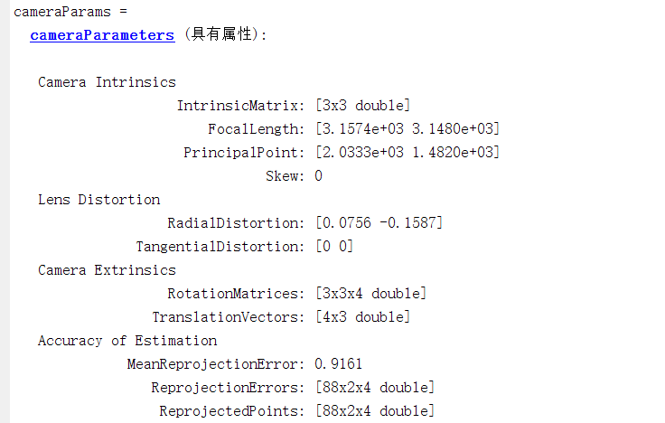

# 计算机视觉第一次作业

> 姓名：邹佳坤
> 
> 学号：21951159
>
> 指导教师：刘二腾

## 1.给图片加名字和学号

matlab代码：

```matlab
imdata = imread('IMG_2012.JPG')
imshow(imdata)
text(60, 2800, '邹佳坤21951159', 'color', 'r', 'FontSize', 30)
```

效果展示：



> 偷偷吐槽一句：matlab导出的图片默认fig格式，这个需要注意一下

## 2.相机标定并对比分析结果

### toolbox标定

toolbox需要自己选定四个角点，结果如下：

```matlab
%-- Focal length:
fc = [ 3134.330764302692400 ; 3127.320696388179800 ];

%-- Principal point:
cc = [ 2024.841857305883900 ; 1492.533869936377600 ];

%-- Skew coefficient:
alpha_c = 0.000000000000000;

%-- Distortion coefficients:
kc = [ 0.068083052888150 ; -0.167313457450124 ; 0.001577657433806 ; 0.000128956195833 ; 0.000000000000000 ];

%-- Focal length uncertainty:
fc_error = [ 13.892496763017606 ; 13.689599115970539 ];

%-- Principal point uncertainty:
cc_error = [ 11.355933135605547 ; 10.531576954480892 ];

%-- Skew coefficient uncertainty:
alpha_c_error = 0.000000000000000;

%-- Distortion coefficients uncertainty:
kc_error = [ 0.006586395445456 ; 0.014859677363690 ; 0.001031831565284 ; 0.001103537561356 ; 0.000000000000000 ];
```


### calibrator标定

calibrator标定直接导入图片，选色块尺寸即可，不需要选角点。

结果如下：



### 比较分析

- 可以看到，其实两种标定方法结果差不多，相差都在3%以内
- toolbox标定的过程较为繁琐，需要对每张图片选定角点，而calibrator只需要添加图片即可
- toolbox图片导入成功率高，而calibrator我用了12张只有4张有效。。。calibrator会判断图片是否重复以及是否合格